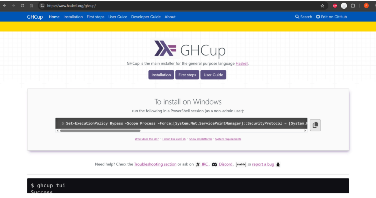
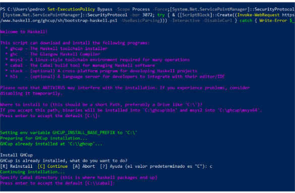
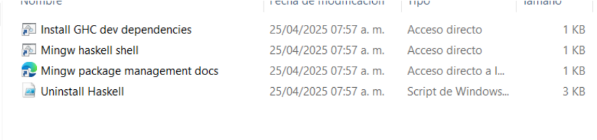
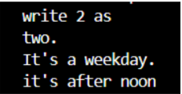

# Practica 3

## Haskell

Abrimos powershell y ejecutamos el comando que sale en la página GHCup    
_“Set-ExecutionPolicy Bypass -Scope Process
-Force;[System.Net.ServicePointManager]::SecurityProtocol =
[System.Net.ServicePointManager]::SecurityProtocol -bor 3072; try { &
([ScriptBlock]::Create((Invoke-WebRequest
https://www.haskell.org/ghcup/sh/bootstrap-haskell.ps1 -UseBasicParsing))) -Interactive
-DisableCurl } catch { Write-Error $_ }”_






__Terminando la instalación__




__Descargamos docker desktop__


## __Segunda sesión.__           
Escogimos el ejemplo del reloj, donde vamos explicar su funcionamiento y de más

```haskell
import Data.Time
import Data.Time.Calendar.WeekDate


main :: IO ()
main = do
    let i =2
    putStrLn $ "write " ++ show i ++ " as "
    case i of
        1 -> putStrLn "one."
        2 -> putStrLn "two."
        3 -> putStrLn "three."
        _ -> putStrLn "Something else."

    now <- getCurrentTime
    let (_, _, week) = toWeekDate . utctDay $ now
    
    putStrLn $
        case week of
            6 -> "It's the weekend."
            7 -> "It's the weekend."
            _ -> "It's a weekday."

    localtime <- utcToLocalZonedTime now
    let hour = todHour . localTimeOfDay . zonedTimeToLocalTime $ localtime
    case hour of
        _
            | hour < 12 -> putStrLn "it's before noon"
            | otherwise -> putStrLn "it's after noon"
```

Tenemos la librería que funcioann par saber la seman y la hora

```haskell
import Data.Time
import Data.Time.Calendar.WeekDate
```

Tenemos nuestro case, por ejemplo declaramos i = 2 entonces nos mostrar el 2

```haskell

main :: IO ()
main = do
    let i =2
    putStrLn $ "write " ++ show i ++ " as "
    case i of
        1 -> putStrLn "one."
        2 -> putStrLn "two."
        3 -> putStrLn "three."
        _ -> putStrLn "Something else."

```

Estas partes son parte fundamental de las librerías, ya que nos ayuda a saber exactamen la
hora y fecha, donde toWeekDate devuelve una tupla: (año, semana del año, día de la semana)

```haskell

    now <- getCurrentTime
    let (_, _, week) = toWeekDate . utctDay $ now
    
```

Otro case, donde nos confirma si es sábado o domingo, hay que anteriormente pedimos con la
función, donde sí da 6 y 7 es fin de semana

```haskell

    putStrLn $
        case week of
            6 -> "It's the weekend."
            7 -> "It's the weekend."
            _ -> "It's a weekday."

```

Por último tenemos la función para saber la hora local, donde utilizaremos un case para saber
si es antes de mediodia o despues

```haskell

    localtime <- utcToLocalZonedTime now
    let hour = todHour . localTimeOfDay . zonedTimeToLocalTime $ localtime
    case hour of
        _
            | hour < 12 -> putStrLn "it's before noon"
            | otherwise -> putStrLn "it's after noon"
            
```

__SALIDA__




