#  __Practica 4__

## __PROLOG__

__Descargamos SWI prolog__

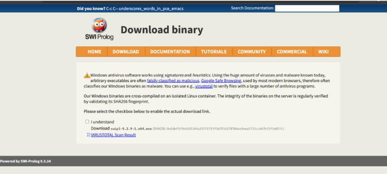

__Ejecutamos el comando swipl__

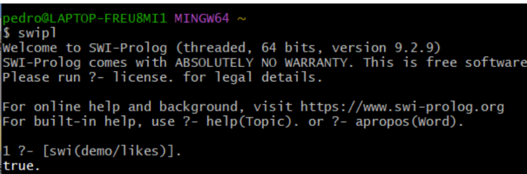

__Creamos una base de conocimiento y la probamos__

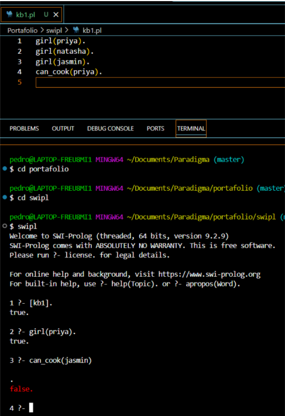

__Creamos otra base de conocimientos con inferencias__

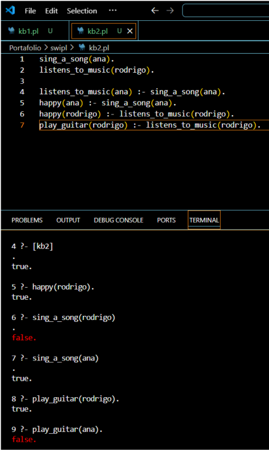

__Creamos otra base de conocimientos con diferentes actores__

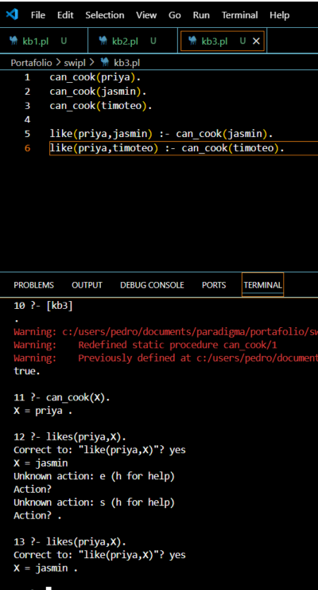

__Hacemos otra base de conocimientos, donde preguntamos quien es hermano.__

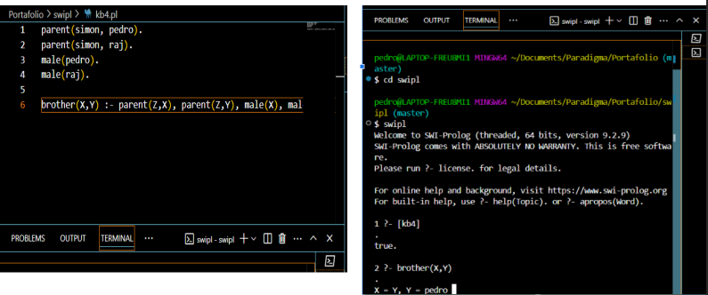

__Base de conocimiento #5 (family.py)__

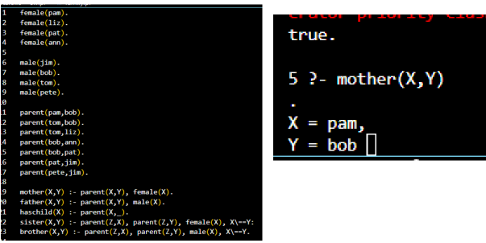

__Base de conocimientos #6 (family_ext.pl)__

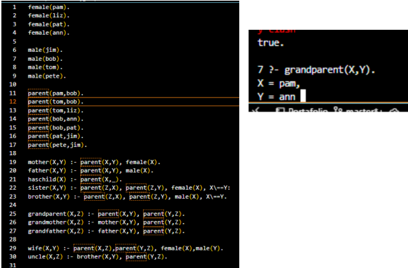

__Base de conocimientos #7 (family_rec.pl)__

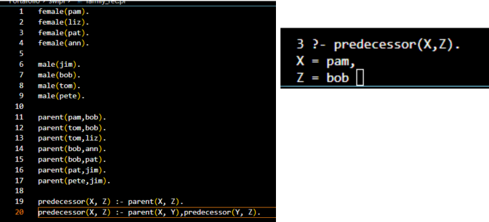

__Programa con Operadores (operadores.pl)__

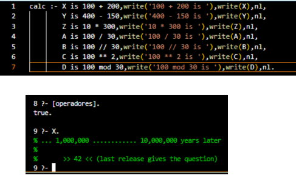

__Operaciones con listas (list_basics.pl)__

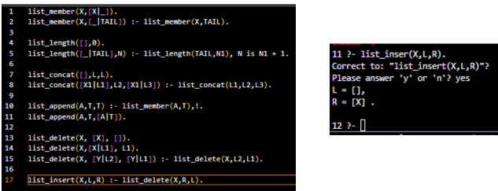

__Operaciones de reposicionamiento de elementos (list_repos.pl)__

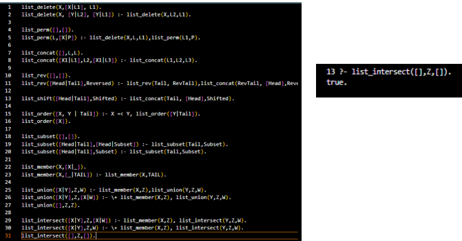

__Otras operaciones en listas (list_misc.pl)__

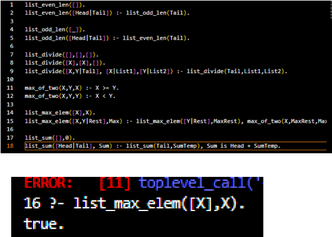